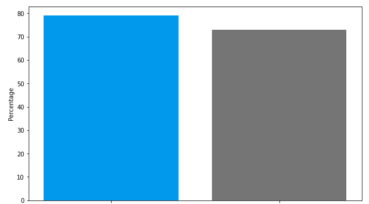

# Telecommunication Churn Project

** Author: Raul Torres


### Overview
As a churn project focused on AT&T customers, my primary objective is to predict which individuals are likely to cancel their use of the company's products or services in the future. To do this, I have been provided with a dataset containing over 7,000 data points related to AT&T customers, including both binary and numerical features. Some examples of binary features include gender, internet service, and partnership status, while numerical features include monthly spending and tenure with the company. The target column in this dataset is labeled "churn," indicating whether or not a customer has cancelled their service.

In order to effectively analyze and make predictions using this data, I have performed a number of preprocessing steps, including cleaning and scaling the data and encoding any categorical variables. I have then utilized a range of machine learning models to generate predictions, ultimately selecting the model that performs best through a process of grid search. By successfully identifying potential churners, I am working to help AT&T reduce customer churn and improve its bottom line.

### Business Problem
The importance of customer retention cannot be overstated, as it is typically more cost-effective to retain existing customers than to acquire new ones. In fact, research has shown that even a modest increase in customer retention can lead to significant profits, with some estimates suggesting that a 5% increase in retention can result in profits increasing by 25% to 95%. This is particularly true in the telecommunications industry, where selling to existing customers has a success rate of 60% to 70%, compared to only 5% to 20% for selling to new customers. These findings highlight the need for companies in the telecommunications industry to prioritize efforts to retain their current customers, in order to maximize profits and remain competitive.

### Methods
In this churn project, a variety of machine learning models were utilized in order to generate accurate predictions. These models included logistic regression, K-nearest neighbors (KNN), and random forest. While all of these models were considered, particular emphasis was placed on the random forest due to its effectiveness for classification tasks, particularly when there is class imbalance, as is often the case with churn data. In order to further optimize the performance of the random forest, a grid search was conducted to identify the best parameters for the model. Ultimately, the random forest was selected as the most effective for this project due to its ability to handle class imbalance and its high performance on the data.

### Results



After conducting a thorough analysis and applying various machine learning models, it was determined that the random forest performed best in predicting customer churn for this project. This model was selected through a process of grid search, which identified the optimal parameters for the model. The random forest achieved an accuracy score of 80% on the test data, which was significantly higher than the baseline model's score of 73%. This demonstrates the effectiveness of the random forest in predicting customer churn, and highlights the importance of using advanced machine learning techniques to accurately identify potential churners.

### Limitationis and Future Plan
There are a few limitations to consider in this churn project. One notable limitation is the size of the dataset, which contained only 7,000 data points. While this is a significant amount of data, it is possible that a larger dataset with more robust historical information could improve the accuracy of the model. Additionally, the model was designed to predict churn for individual customers, and did not take into account broader patterns or trends within the company. In the future, it would be beneficial to analyze feature importance and consider the overall company context to gain a deeper understanding of why customers may be cancelling their service. This could potentially lead to the development of targeted retention strategies that address common pain points or concerns among customers. Overall, there is still room for improvement and further exploration in this project.

### Conclusion
In conclusion, this churn project successfully utilized machine learning techniques to predict which AT&T customers were likely to cancel their service in the near future. By analyzing a variety of data sources and applying a range of models, including logistic regression, K-nearest neighbors, and random forest, we were able to identify the random forest as the most effective in predicting churn. The final model achieved an accuracy score of 80%, significantly higher than the baseline model's score of 73%. While there were a few limitations to this project, including the size of the dataset and the lack of consideration for broader company trends, the results demonstrate the potential for machine learning to accurately predict customer churn and inform retention efforts.

## Sources and more information
The data was gathered from Kaggle https://www.kaggle.com/datasets/blastchar/telco-customer-churn

I reviewed many projects for inspiration and guidance. 
These are some examples:
This is by SRUSHANTH BARIDE https://www.kaggle.com/code/srushanthbaride2010/customer-churn-prediction-score-0-96000/notebook
This is by ATINDRABANDI https://www.kaggle.com/code/bandiatindra/telecom-churn-prediction
This is by Gabriel Atkin https://www.youtube.com/watch?v=NnQd8Q50EXM&list=LL&index=2

The top-level README for reviewers of this project
Narrative documentation of analysis in Jupyter notebook
## Repository Structure

```
├── Data                                <- Data folder used of this project.
├── Images                              <- Images folder used for this project.
├── Scratch code                        <- Processed_notebook folder used for this project
└── Churn_Project_Notebook.ipynb        <- Narrative documentation of analysis in Jupyter notebook
└── README.md                           <- README for reviewers of this project
```


